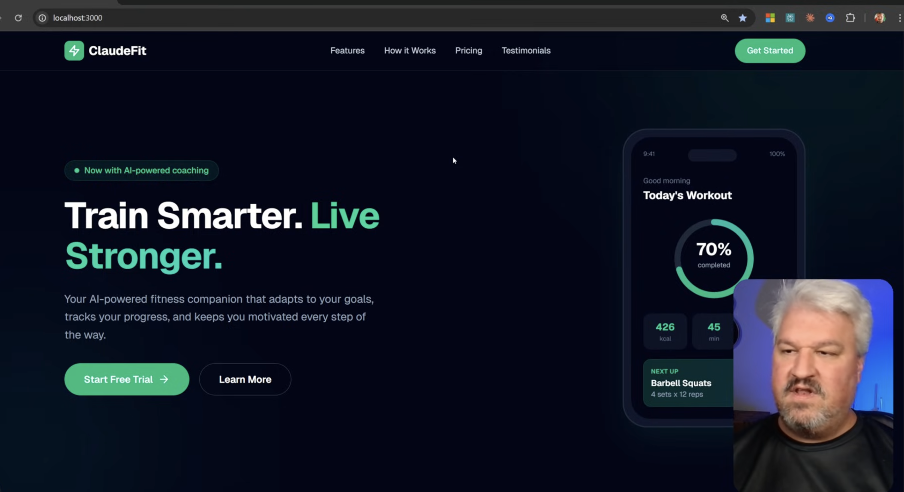
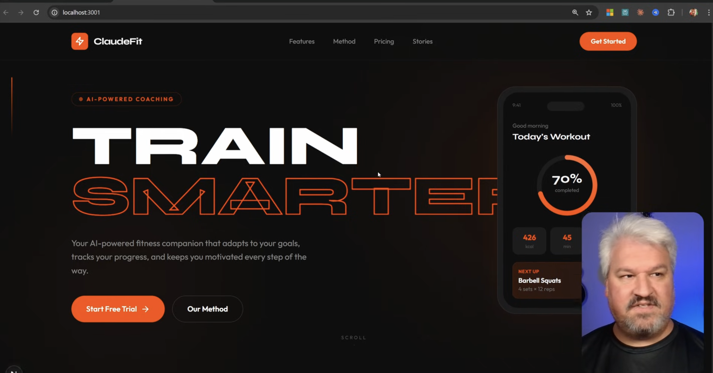
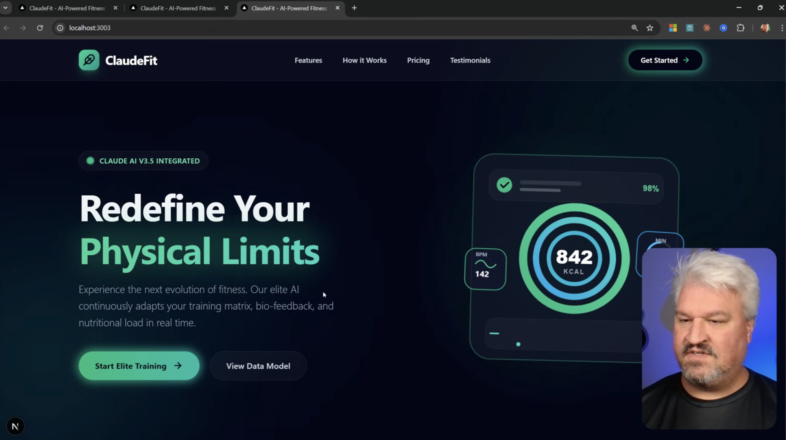

# Example: Fitness App

## Vanilla Prompt
```
Hey there, please can you change this borderplate Next.js project into a fitness tracker app? Don't worry about backend functionality or anything like that; we simply want to build the landing page for this fictitious fitness tracker app. Its called ClaudeFit. you are welcome to come up with a copy. You can use stock images. It's really up to you. Simply try to create a beautiful UI, and that's it. Go for it.
```



Good but AI generic design

<br/>
<br/>

## Create 3 Worktrees to test
* skill
* design system from screenshot
* gemini-3-pro

```
Create 3 git worktrees of this project
* skill
* design system
* gemini-3-pro
```
* Claude code will create 3 replica with its name at the same level of your existing project.

## Skill Approach
* Add frontend design skill and use it to build
```
npx skills add https://github.com/anthropics/skills --skill frontend-design
```

### Custom prompt
```
Hey, I need you to redesign this fitness tracker app using your front end design skill. Carefully consider colours and font choices, and even stock images that fit the theme of a fitness tracker app.
```


## Design System Approach
* Go to dribbble.com to get the right image
```
Please create a complete design system based on the attached image. I need you to match the fonts, the colour schemes, the layout, the design, and the vibe, and then create a complete design system and store it in the docs/design folder. [image #1]
```


## Gemini 3 Pro Approach
```
Hey, I need you to redesign this fitness tracker app as it's very bland and very AI-sloppish. I want you to do your best to correct the font and the colours and the style and the vibe to work with a fitness tracker app. Also lean into your strength of creating animations and SVGs.
```




## Merge
* Decide which one to use and merge the right worktree and remove others.